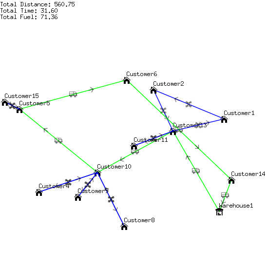

# Example

## Input

```
Warehouse1;-1;27;0
Warehouse2;-14;-43;0
Customer1;36;17;8
Customer2;-45;-19;12
Customer3;46;-32;4
Customer4;-14;-33;4
Customer5;-37;5;1
Customer6;12;44;15
Customer7;37;-34;7
Customer8;-10;47;6
Customer9;-28;50;1
Customer10;49;-48;8
Customer11;-19;-12;10
Customer12;-47;30;6
Customer13;-23;-37;5
Customer14;-11;-44;14
Customer15;-16;3;6
```

## Output

### Best Insertion


### Best Insertion with Drone Strike Insertion


### Closest Neighbor


### Closest Neighbor with Drone Strike Insertion


### Greedy Coverage by Drones



### Greedy Coverage by Drones (Maxed out drones influence)


