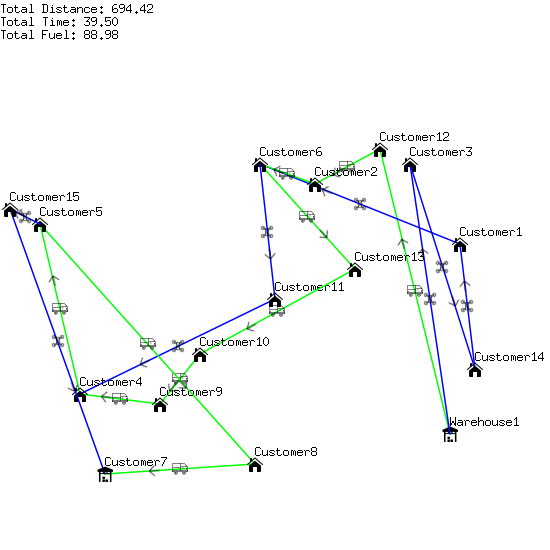
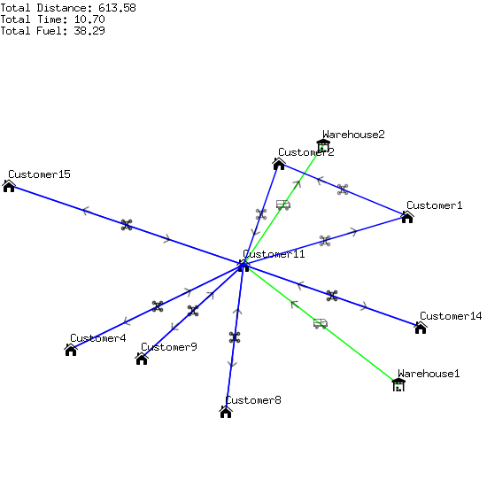

# Example

## Input

```
Warehouse1;29;40;0
Warehouse2;-25;23;0
Customer1;-9;42;3
Customer2;-21;13;6
Customer3;-25;32;14
Customer4;21;-34;3
Customer5;-13;-42;12
Customer6;-25;2;12
Customer7;37;-29;0
Customer8;35;1;9
Customer9;23;-18;10
Customer10;13;-10;12
Customer11;2;5;2
Customer12;-28;26;11
Customer13;-4;21;11
Customer14;16;45;6
Customer15;-16;-48;10
```

## Output

### Best Insertion


### Best Insertion with Drone Strike Insertion


### Best Insertion with Drone Strike Insertion + Car to Drone Shift


### Best Insertion with Drone Strike Insertion + Drone to Car Shift


### Best Insertion with Drone Strike Insertion + Car and Drone Swap


### Closest Neighbor


### Closest Neighbor with Drone Strike Insertion


### Closest Neighbor with Drone Strike Insertion + Car to Drone Shift



### Closest Neighbor with Drone Strike Insertion + Drone to Car Shift


### Closest Neighbor with Drone Strike Insertion + Car and Drone Swap


### Greedy Coverage by Drones


### Greedy Coverage by Drones (Maxed out drones influence)


